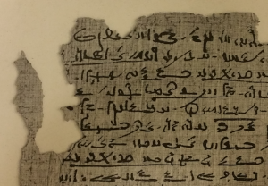

  

      <ul class="nav">
          <!--<li><a href="{{ BASE_PATH }}/cross_cv.pdf">cv</a></li>
          <!--<li><a href="https://github.com/jjcross">github</a></li>
          <li><a href="{{ BASE_PATH}}/blog">blog</a></li>
         <li><a href="https://twitter.com/jjjjjjjjjjcross">@jjjjjjjjjjcross</a></li>-->
      </ul>
  

<table class="wide">
<tr align="left">
  <td class="left" align="right">
    
  </td>
  <td class="left" align="left">
    
  </td>
</tr>
<tr align="left" align="right">
  <td class="right">
    
  </td>
  <td class="right" align="left">
    
  </td>
</tr>
</table>

  

      <ul class="nav">
          <li></li>
      </ul>
  

