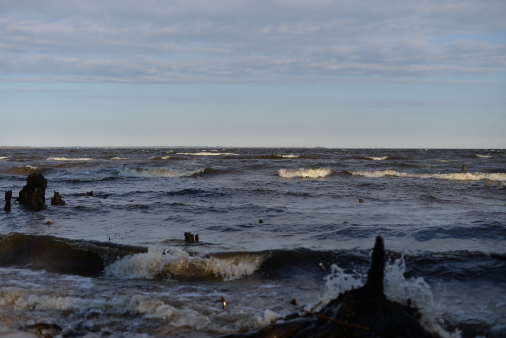

  

      <ul class="nav">
          <li><a href="esther.html">prev</a></li>
          <li><a href="me_clock.html">next</a></li>
      </ul>
  

We lived about an hour from the Alligator River of North Carolina from 2020-2022, when we moved to Berlin for my job. That was where I finished my dissertation. We were on the coast, in Kill Devil Hills, NC on the Outer Banks; a beach resort where much of my family lived and some still live, since the '80s. Today the Alligator River is mostly used for people sailing up and down the Intercoastal Waterway of the East Coast US. To the left in this picture, out of sight, up the river a bit and on the western bank, you'll find Mill Tail Creek, which leads into the swampy interior of the Alligator Swamp, and this may be where some of the original English colonists from Roanoke Island settled after their colony was dispersed there by 1590. The water of the Alligator River is so black because it has been dyed by thousands of years of black mud accumulating from the surrounding swamps, a biome called the pocosin. The water however (at least before the onset of pollution) is clear and fresh, and was used by bootleggers in the depths of the swamps through the early 20th century. A remnant of this is the ghost town of Buffalo City (also on Mill Tail Creek), also a famous logging town.
