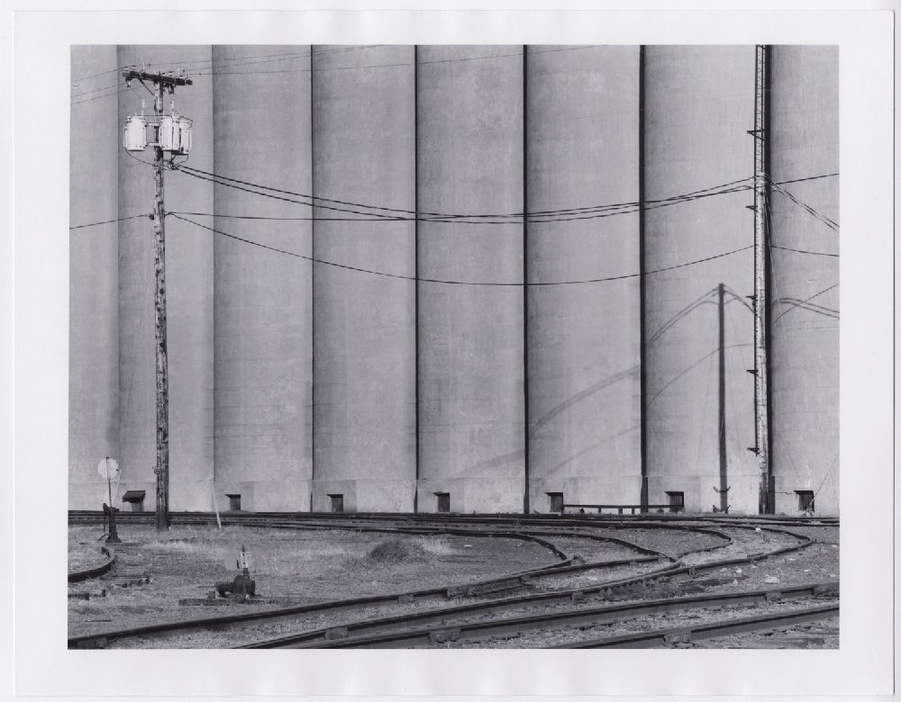

  

      <ul class="nav">
          <li><a href="rqtlexper_fig2.html">prev</a></li>
          <li><a href="phyloqtl_fig2.html">next</a></li>
      </ul>
  

General Mills Elevator "A". Duluth, Minnesota (685-517 or 685-577), taken by the American photographe [David Plowden](https://en.wikipedia.org/wiki/David_Plowden) (1948-2011). His photographs are [held in the Beinike Library at Yale](https://archives.yale.edu/repositories/11/resources/5817).

Monumental verticality.

The Abstract Expressionist Clyfford Still painted [a lot of grain elevators](https://luna.clyffordstillmuseum.org/luna/servlet/view/all/what/grain%2Belevators?sort=mediafileName) in his early years

Beinike photo
WA MSS S-2957 [[source](https://collections.library.yale.edu/catalog/2042667)]
