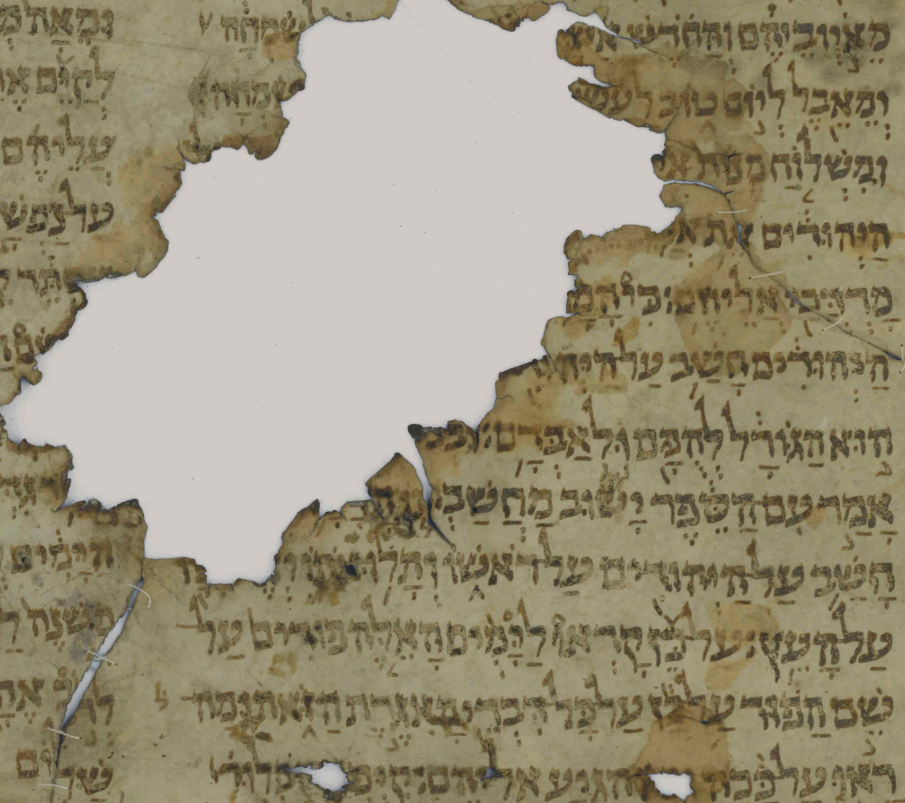

  

      <ul class="nav">
          <li><a href="pspiegelberg.html">prev</a></li>
          <li><a href="alligator_river.html">next</a></li>
      </ul>
  

One of the biblical texts I work on the most is the book of Esther. It was written originally in Hebrew, but unlike much of the Hebrew Bible, there are no surviving ancient manuscripts of this work, which I (and others) call a novella, though it was first written around the 5th or 4th century BCE. This fragment is from the medival Jewish community in Cairo, from a treasury of abandoned and disused scrolls, books, and fragments, called a Geniza, where hundreds of thousands of manuscripts were discovered around 1900. They are all over the world, but many if not most are in Cambridge, which is where this fragment, identified today as "T-S A 19.1" can be found. This is a later copy of a traditional Hebrew text that was copied for hundreds of years. We can trust that these versions are very similar to ones much closer to the original time of composition, but it is also important to look at ancient translations of this work which survive, especially those made by Greek-speaking Jews in Egypt and Palestine around the turn of the era.
