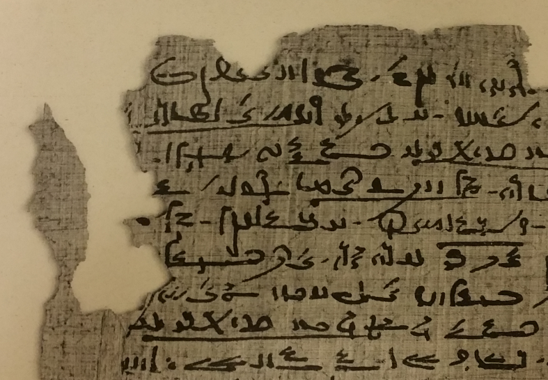

  

      <ul class="nav">
          <li><a href="esther.html">prev</a></li>
          <li><a href="me_clock.html">next</a></li>
      </ul>
  

This is a portion of what Egyptologists call Papyrus Spiegelberg (from column 7 of an original scroll that was 20-30 columns or more), which was written down somewhere in the 1st century BCE in Egypt. This is written in the Demotic form of the Egyptian language, which developed later in Egyptian history than hieroglyphs (and was originally itself a cursive version of hieroglyphs, but by this point it was an independent script in its own right). It is a story (which I call a novella) about a hapless pharaoh trying to secure a high-ranking priestly office for his son at the famous temple of Karnak. Things go awry! Most of the story survives, but much has to be reconstructed, not only because of holes like on the surface of the papyrus scroll shown here, but because other pieces of the same scroll have turned up in other libraries and museums; most of P. Spiegelberg is in Strasbourg, but other pieces are in Paris and Cairo. 

