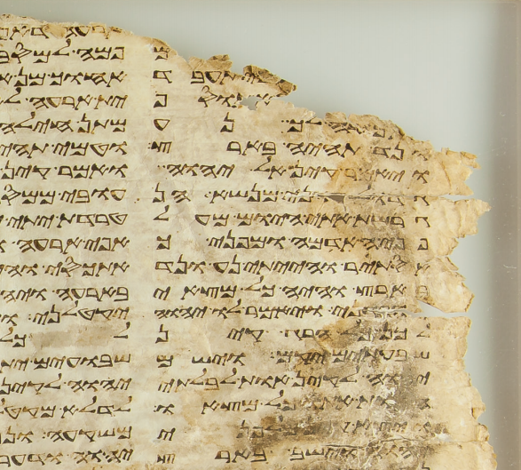

  

      <ul class="nav">
          <li><a href="rqtlexper_fig2.html">prev</a></li>
          <li><a href="phyloqtl_fig2.html">next</a></li>
      </ul>
  

Closeup of a fragment of a triglot Samaritan Torah codex in the Oriental Institute (Chicago), OIM A6957.

